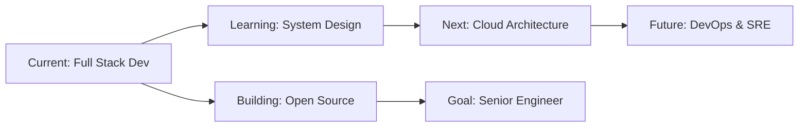

<div align="center">
  
# 👨‍💻 Shreyas Sherekar


<p align="center">
  <a href="https://linkedin.com/in/shreyas-sherekar-4811a1255"></a>
  <a href="mailto:shreyas.sherekar@gmail.com"></a>
  <a href="https://your-portfolio.com"></a>
  
</p>

</div>

---


### 🚀 About Me

```typescript
const shreyas = {
    location: "India 🇮🇳",
    current_focus: "Full-Stack Development",
    stack: ["MERN", "Django", "FastAPI"],
    learning: ["System Design", "Cloud Architecture", "DevOps"],
    interests: ["Web3", "AI/ML", "Open Source"],
    goal: "Building scalable solutions that matter",
    philosophy: "Code with purpose, learn with passion"
};
```

🔭 Currently building **scalable web applications** with modern tech stacks  
🌱 Deep diving into **Backend Architecture** & **System Design**  
💡 Contributing to **Open Source** - making the web better, one commit at a time  
🎯 2026 Goals: Master **microservices** & contribute to **major OSS projects**  
💬 Let's talk about **React**, **Node.js**, **MongoDB**, **System Design**, or **Tech Career**  
⚡ Fun fact: I debug with `console.log()` and I'm not ashamed!

<br clear="both">

---

## 🛠️ Tech Arsenal

<div align="center">

### 💻 Languages & Core


### ⚛️ Frontend Development


### 🔧 Backend Development  


### 🗄️ Databases & Cloud


### 🚀 DevOps & Tools


</div>

---

## 📊 GitHub Analytics

<div align="center">
  
  
</div>

<div align="center">
  
  
</div>

### 🏆 GitHub Achievements

<div align="center">
  
</div>

### 📈 Contribution Activity

<div align="center">
  
</div>

## 🌟 Featured Projects:

---

## 🌟 Featured Projects

<div align="center">
  
<table>
<tr>
<td width="50%">
  
### 🚀 [Project Name 1](https://github.com/shreyas2228/your-awesome-project)
  

---

## 🤝 Let's Connect & Collaborate

<div align="center">

### 📫 Reach Out to Me

<p>
  <a href="https://linkedin.com/in/shreyas-sherekar-4811a1255">
    
  </a>
  <a href="mailto:shreyas.sherekar@gmail.com">
    
  </a>
  <a href="https://twitter.com/your_twitter">
    
  </a>
  <a href="https://your-portfolio.com">
    
  </a>
  <a href="https://instagram.com/your_instagram">
    
  </a>
</p>

### 💼 Open for Opportunities

```yaml
Status: 🟢 Available for Freelance Projects
Looking for: Full-time Opportunities | Collaborations | Open Source
Interested in: Web Development | System Design | Cloud Architecture
```

</div>

---

## 💖 Support My Work

<div align="center">

If you find my work valuable or learned something from my projects:

<p>
  <a href="https://buymeacoffee.com/shreyas2228">
    
  </a>
  <a href="https://ko-fi.com/shreyas2228">
    
  </a>
  <a href="https://github.com/sponsors/shreyas2228">
    
  </a>
</p>

**⭐ Star my repositories if you find them useful!**

</div>

---

<div align="center">

### 💭 Developer Quote


### 🐍 Watch the Snake Eat My Contributions


---

<p>
  
</p>

**⚡ "Code is like humor. When you have to explain it, it's bad." – Cory House**

*Made with ❤️ by Shreyas | Last Updated: January 2026*
  
</a>

</div>

---

## ✍️ Latest Blog Posts & Articles

<!-- BLOG-POST-LIST:START -->
📝 *Coming Soon - Stay tuned for technical articles on web development, system design, and best practices!*
<!-- BLOG-POST-LIST:END -->

<div align="center">
  <a href="https://dev.to/yourusername"></a>
  <a href="https://medium.com/@yourusername"></a>
  <a href="https://hashnode.com/@yourusername"></a>
</div>

---

## 🎯 Current Focus & Learning Path



<div align="center">

**📚 Currently Reading:** *Designing Data-Intensive Applications*  
**🎓 Learning:** AWS Solutions Architect | Kubernetes | Microservices  
**🎯 2026 Goals:** 100+ GitHub contributions | 5 major OSS contributions | Launch SaaS product

</div

<div align="center">
  
  [](https://linkedin.com/in/shreyas-sherekar-4811a1255)
  [](https://twitter.com/your_twitter)
  [](https://instagram.com/your_instagram)
  [](https://your-portfolio.com)
  [](mailto:shreyas.sherekar@gmail.com)

</div>

## 💰 Support My Work:

<div align="center">
  
  [](https://buymeacoffee.com/shreyas2228)
  [](https://paypal.me/shreyas2228)
  [](https://ko-fi.com/shreyas2228)

</div>

---

<div align="center">
  
  
  
  <h3>💡 "The only way to do great work is to love what you do" - Steve Jobs</h3>
  
  

</div>